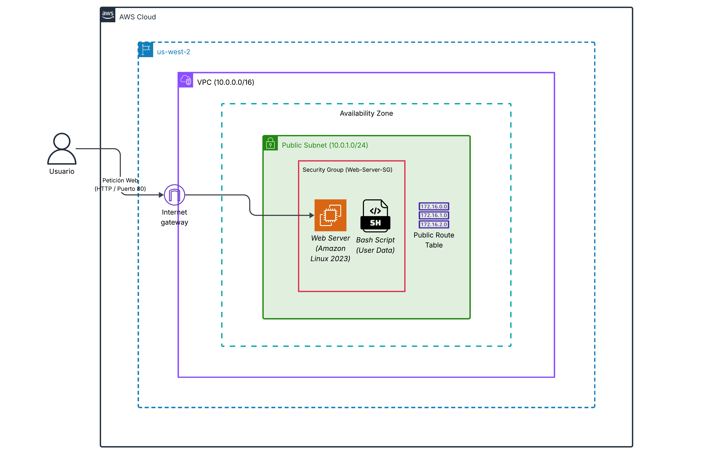

# Automated Web Server Provisioning on AWS VPC

Este repositorio contiene la documentación técnica y el script de automatización para diseñar una
infraestructura de red segura en Amazon Web Services (AWS) y aprovisionar de forma autónoma un
servidor web Apache sobre una instancia Amazon Linux 2023.

El objetivo principal de este proyecto es eliminar las tareas repetitivas de instalación manual
mediante scripts de inicialización ( _User Data_ ), demostrando habilidades en redes, seguridad cloud y
administración de sistemas Linux.

## 🗺 Arquitectura del Proyecto

El siguiente diagrama ilustra el flujo de tráfico desde el usuario final hasta la instancia EC2, detallando
las capas de red (VPC, Subred Pública), enrutamiento (Internet Gateway, Route Table) y seguridad
(Security Group como cortafuegos perimetral):



_Diseñado en Lucidchart utilizando la biblioteca oficial de iconos de arquitectura de AWS (2026)._

## 🎯 Objetivos de Aprendizaje

1. __Diseño de Redes en AWS:__ Creación de una VPC personalizada, subred pública aislada y tablas
de ruteo conectadas a un Internet Gateway.
2. __Seguridad Perimetral:__ Configuración de un Security Group actuando como firewall a nivel de
instancia, permitiendo únicamente tráfico entrante en puertos HTTP (80) y SSH (22).
3. __Automatización del Aprovisionamiento (Bootstrapping):__ Uso de scripts de Bash en la fase de
inicialización de instancias EC2 para la automatización completa del despliegue del servidor
web.

## 🔧 Guía de Despliegue Paso a Paso

### 1. Infraestructura de Red (VPC)

- __Creación de VPC:__ Crear una VPC con bloque CIDR 10.0.0.0/16 (nombre: Startup-VPC).
- __Gateway de Internet:__ Crear un Internet Gateway (Startup-IGW) y asociarlo a la VPC.
- __Subred Pública:__ Crear una subred con el bloque CIDR 10.0.1.0/24 (nombre: Startup-
Subnet-Publica).
- __Tabla de Ruteo:__ Agregar una ruta en la Route Table local que apunte todo el tráfico saliente
(0.0.0.0/0) hacia el Startup-IGW.

### 2. Seguridad (Security Group)


- Crear un Grupo de Seguridad llamado Web-Server-SG asociado a Startup-VPC.
- Configurar las siguientes reglas de entrada ( Inbound Rules ):
  - __HTTP (Puerto 80):__ Desde cualquier origen (0.0.0.0/0).
  - __SSH (Puerto 22):__ Para administración segura (se recomienda restringir a tu IP pública).

### 3. Lanzamiento de Instancia EC2 & Bootstrapping


Lanzar una instancia EC2 de tipo t2.micro (o t3.micro) con la AMI oficial de Amazon Linux
2023.
Vincularla a la Startup-Subnet-Publica y habilitar la autoasignación de IP pública.
En la sección Advanced Details > User Data, ingresar el siguiente script de automatización:

```
#!/bin/bash
# Actualizar los paquetes del sistema
dnf update -y

# Instalar el servidor web Apache
dnf install -y httpd

# Iniciar el servicio del servidor web
systemctl start httpd

# Habilitar el servidor para que inicie si la máquina se reinicia
systemctl enable httpd

# Crear una página web personalizada de prueba
echo "<html><body><h1>¡Despliegue automatizado exitoso!</h1><p>El equipo de la Sta
```
## 🧪 Pruebas y Validación


1. Una vez que la instancia EC2 se encuentre en estado Running, copie su dirección IPv4 pública
desde la consola de AWS.
2. Abra una pestaña en su navegador e ingrese a http://<IP_PUBLICA>.
3. Deberá ver la página web HTML generada automáticamente por el script Bash de User Data.

## 🚀 Habilidades Demostradas


- __AWS Cloud Infrastructure:__ Uso de consola, VPC, direccionamiento CIDR, Internet Gateways y
tablas de enrutamiento.
- __Administración de Servidores Linux:__ Actualización de paquetería, gestión de servicios del
sistema operativo (systemd) mediante Bash.
- __Seguridad Cloud:__ Implementación de principios de mínimo privilegio mediante Security Groups
y segmentación de red.
- __Automatización / DevOps:__ Conceptos iniciales de aprovisionamiento ágil e infraestructura
automatizada.

## 📚 Programa AWS re/Start & Generation Chile


re/Start dictado por Generation Chile, diseñado para adquirir habilidades técnicas clave en soporte,
administración de sistemas y conceptos cloud de Amazon Web Services.


